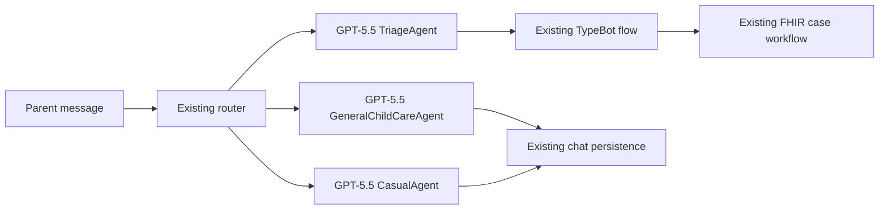

# Oykomed Integrator GPT-5.5 Agent Migration

## Purpose

Replace the three existing parent-facing AI agents in `Oykomed-Integrator/oykomed` with specialist GPT-5.5 agents while keeping the router, TypeBot, FHIR case lifecycle, persistence, and client contracts unchanged.

The three agents are:

| Agent | Existing entry point | Existing fallback model | Replacement |
|---|---|---|---|
| Triage | `AiRoutingService.getUserQueryIntentAndSymptoms()` | Fine-tuned GPT-4.1 | Catalog-constrained GPT-5.5 extraction |
| General child care | `AiRoutingService.executeAdvisorModel()` | GPT-5.1 | GPT-5.5 profile-aware advice |
| Casual | `AiRoutingService.executeCasualModel()` | GPT-4.1 | GPT-5.5 streamed conversation and refusal handling |

The router remains a dispatcher. TypeBot remains downstream from the triage agent and is not changed by this migration.



## Evidence and Scope

The standalone extraction system uses a single GPT-5.5 call with a full symptom catalog and constrained structured output. Its documented evaluation result is 839 correct messages out of 860, or 97.6 percent exact-message accuracy.

References in this repository:

- [Standalone system overview](../README.md)
- [Extraction architecture](SYSTEM_ARCHITECTURE.md)
- [GPT-5.5 evaluation](EVALUATION_REPORT.md)
- [Canonical symptom catalog](../data/catalog/symptom_catalog.json)
- [Existing Integrator routing service](../Oykomed-Integrator/oykomed/packages/server/src/oykomed/services/aiRoutingService.ts)
- [Existing Integrator prompts](../Oykomed-Integrator/oykomed/packages/server/src/oykomed/constants/aiPrompts.ts)

`Oykomed-Integrator` is currently an untracked local directory in this repository. The Integrator code changes must be committed in its own repository or added deliberately in a separate change. This document is a design and implementation plan only.

## Non-Goals

- Do not change TypeBot questions, sessions, or case progression.
- Do not change FHIR `Communication` identifiers or the existing `TriageFlowIdentification` shape.
- Do not replace the router model in this migration.
- Do not deploy the optional Python five-stage retrieval pipeline. The evaluated one-call catalog baseline is the production target.
- Do not remove the existing `CGPTUtils` retry, timeout, concurrency, logging, or streaming facilities.

## Target Layout

Create a small, explicit agent layer under the Integrator server package:

```text
packages/server/src/oykomed/aiAgents/
  agentModelConfig.ts          # GPT-5.5 model IDs and migration mode
  gpt55AgentClient.ts          # Shared Chat Completions wrapper over CGPTUtils
  prompts.ts                   # Triage, advice, and casual prompts
  triage/
    symptomCatalog.ts          # Canonical symptom entries keyed by code
    triageAgent.ts             # Catalog constrained extraction
    triageAdapter.ts           # TriageAgentResult -> TriageFlowIdentification
  generalChildCareAgent.ts     # Profile-aware general guidance
  casualAgent.ts               # Normal/refusal conversation with streaming
  types.ts                     # Agent-only request and response types
```

Keep `AiRoutingService` as the orchestration boundary. It should construct the three agents once and delegate existing public methods to them.

## Phase 0: Decide and Freeze the Canonical Catalog

Do this before implementation. It prevents a model result from being correctly extracted but failing downstream confirmation or clarification behavior.

Current local comparison found:

| Catalog source | Label count |
|---|---:|
| New extraction catalog | 81 |
| Legacy `SYMPTOM_EXPLANATIONS` map | 82 |
| Exact label overlap | 77 |

The notable differences are:

- The new catalog uses expanded labels for `Poliuria` and `Pollachiuria`.
- The new catalog contains `Terrore notturno`.
- The legacy map contains `Feci molli`, `Erezioni frequenti`, and a long legacy sleep-terror label.

### Decision

Use the new catalog's `code` as the canonical integration identifier. A catalog entry must include both the stable code and the display label:

```ts
export type SymptomCatalogEntry = {
  code: string;
  labelIt: string;
  labelEn: string;
  triageDepth: 'Alta' | 'Media';
  shortDefinition: string;
};

export const symptomCatalog: readonly SymptomCatalogEntry[] = [
  {
    code: 'SI001',
    labelIt: 'Febbre',
    labelEn: 'Fever',
    triageDepth: 'Alta',
    shortDefinition: 'Aumento della temperatura corporea rispetto al normale.',
  },
];

export const symptomByCode = new Map(
  symptomCatalog.map((symptom) => [symptom.code, symptom])
);
```

The implementation must never trust a model-provided label. It accepts only a code and derives `labelIt` from `symptomByCode`.

Before production rollout, reconcile all 81 or 82 entries with clinical product ownership and generate `symptomCatalog.ts` from `data/catalog/symptom_catalog.json`. Do not maintain two manually edited symptom lists.

## Phase 1: Add Shared GPT-5.5 Configuration

### 1. Configure existing model-secret fields

Keep the current `CUSTOM_AI_MODEL_NAMES` secret shape. Update only the three agent model IDs:

```json
{
  "ROUTER_MODEL_ID": "<keep-existing-router-model>",
  "TRIAGE_MODEL_ID": "gpt-5.5-2026-04-23",
  "ADVICE_MODEL_ID": "gpt-5.5-2026-04-23",
  "CASUAL_MODEL_ID": "gpt-5.5-2026-04-23"
}
```

Do not change `ROUTER_MODEL_ID` in this migration. The router decides which of the three specialist agents runs.

### 2. Add explicit migration mode

Add a non-secret `AI_AGENT_MIGRATION_MODE` setting with these values:

| Value | Behavior |
|---|---|
| `legacy` | Current implementation only |
| `shadow` | Run the GPT-5.5 agent, log a redacted comparison, return the legacy result |
| `enabled` | Return the GPT-5.5 agent result |

The default must be `legacy`. Enable agents independently so triage can be released before advice and casual.

```ts
export type AgentMigrationMode = 'legacy' | 'shadow' | 'enabled';

export function getAgentMigrationMode(agent: 'triage' | 'advice' | 'casual'): AgentMigrationMode {
  const value = process.env[`AI_${agent.toUpperCase()}_AGENT_MODE`] || 'legacy';
  return value === 'shadow' || value === 'enabled' ? value : 'legacy';
}
```

### 3. Confirm data residency before enabling

`CGPTUtils` currently uses the EU endpoint only for `gpt-4.1-2025-04-14`; GPT-5.5 would currently use the US endpoint. Confirm the approved endpoint, data-processing agreement, retention settings, and request logging policy for pediatric data before moving any agent to `enabled`.

## Phase 2: Implement the Shared Client

Use the existing `CGPTUtils` transport. It already provides SSM-backed credentials, bounded concurrency, retries, metrics, timeout handling, and streaming. The agent layer only standardizes model choice and parsing.

```ts
import { CGPTUtils, DEFAULT_AI_TIMEOUT_MS } from '../aiOperations/cgpt';

export const GPT55_MODEL_ID = 'gpt-5.5-2026-04-23';

export class Gpt55AgentClient {
  public constructor(private readonly cgptUtils = new CGPTUtils()) {}

  public async complete(
    systemPrompt: string,
    userPrompt: string,
    options: {
      model: string;
      tools?: unknown[];
      toolChoice?: 'auto';
      maxTokens?: number;
    }
  ): Promise<unknown> {
    const messages: unknown[] = [
      { role: 'system', content: systemPrompt },
      { role: 'user', content: userPrompt },
    ];

    return this.cgptUtils.retryAI(
      messages,
      options.model,
      options.tools,
      options.toolChoice,
      undefined,
      DEFAULT_AI_TIMEOUT_MS,
      options.maxTokens
    );
  }
}
```

Use `undefined` for temperature in the shared client. The triage agent needs deterministic structured extraction, and model parameters must be set per agent only after confirming they are supported by GPT-5.5.

Do not create a second OpenAI SDK client or duplicate the existing request retry logic.

## Phase 3: Implement the Triage Agent

### Public contract

Keep the current Integrator contract unchanged:

```ts
export type TriageFlowIdentification = {
  isTriage: boolean;
  symptoms: string[];
  newSymptoms: string[];
  needsSymptomDescription?: boolean;
  symptomDescriptionMessage?: string;
};
```

Internally, use a richer code-first result:

```ts
export type ExtractedSymptom = {
  code: string;
  evidenceSpan: string;
  negated: boolean;
  hedged: boolean;
  temporalStatus: 'current' | 'past_resolved' | 'chronic';
  confidence: 'high' | 'medium' | 'low';
  onset?: string;
};

export type ExcludedSymptom = {
  code: string;
  reason: 'negated' | 'past_resolved' | 'below_threshold';
  evidenceSpan?: string;
};

export type TriageAgentResult = {
  symptoms: ExtractedSymptom[];
  excluded: ExcludedSymptom[];
  unmappedComplaints: string[];
};
```

### Structured tool schema

Constrain symptom codes in the tool schema and derive labels locally. Do not use an independent label enum.

```ts
const symptomCodes = symptomCatalog.map((symptom) => symptom.code);

const triageTool = {
  type: 'function' as const,
  function: {
    name: 'extract_pediatric_symptoms',
    parameters: {
      type: 'object',
      additionalProperties: false,
      properties: {
        symptoms: {
          type: 'array',
          items: {
            type: 'object',
            additionalProperties: false,
            properties: {
              code: { type: 'string', enum: symptomCodes },
              evidenceSpan: { type: 'string' },
              negated: { type: 'boolean' },
              hedged: { type: 'boolean' },
              temporalStatus: {
                type: 'string',
                enum: ['current', 'past_resolved', 'chronic'],
              },
              confidence: { type: 'string', enum: ['high', 'medium', 'low'] },
              onset: { type: ['string', 'null'] },
            },
            required: ['code', 'evidenceSpan', 'negated', 'hedged', 'temporalStatus', 'confidence'],
          },
        },
        excluded: {
          type: 'array',
          items: {
            type: 'object',
            additionalProperties: false,
            properties: {
              code: { type: 'string', enum: symptomCodes },
              reason: { type: 'string', enum: ['negated', 'past_resolved', 'below_threshold'] },
              evidenceSpan: { type: ['string', 'null'] },
            },
            required: ['code', 'reason'],
          },
        },
        unmappedComplaints: {
          type: 'array',
          items: { type: 'string' },
        },
      },
      required: ['symptoms', 'excluded', 'unmappedComplaints'],
    },
  },
};
```

### Post-processing and adapter

Validate every code against `symptomByCode`; verify every evidence span is a substring of the original parent message; remove duplicate codes; and move negated or past-resolved symptoms to `excluded` even if the model placed them in `symptoms`.

```ts
const GENERIC_ILLNESS = /\b(non\s+sta\s+bene|non\s+si\s+sente\s+bene|sta\s+male|è\s+malat[oa]|è\s+ammalat[oa])\b/i;

export function toTriageFlowIdentification(
  message: string,
  result: TriageAgentResult
): TriageFlowIdentification {
  const symptoms = result.symptoms
    .filter((symptom) => !symptom.negated && symptom.temporalStatus !== 'past_resolved')
    .map((symptom) => symptomByCode.get(symptom.code)?.labelIt)
    .filter((label): label is string => Boolean(label));

  const needsSymptomDescription =
    symptoms.length === 0 && result.unmappedComplaints.length === 0 && GENERIC_ILLNESS.test(message);

  return {
    isTriage: symptoms.length > 0 || result.unmappedComplaints.length > 0 || needsSymptomDescription,
    symptoms,
    newSymptoms: result.unmappedComplaints,
    needsSymptomDescription,
    symptomDescriptionMessage: needsSymptomDescription
      ? 'Per favore, prova a descrivermi con le tue parole uno o più sintomi che il bambino sta mostrando.'
      : '',
  };
}
```

This preserves current TypeBot behavior without changing TypeBot itself:

- `symptoms` continues to populate `VALID_SYMPTOMS` and the FHIR case topic.
- `newSymptoms` continues to populate `NEW_SYMPTOMS` and trigger its existing notification behavior.
- `needsSymptomDescription` continues to use the existing guidance loop.
- `excluded` is not treated as an active symptom. Log only a redacted audit record containing codes and reasons.

### Delegation from `AiRoutingService`

Replace only the internals of `getUserQueryIntentAndSymptoms()`. Keep the method name and arguments until all current call sites are migrated.

```ts
async getUserQueryIntentAndSymptoms(
  userQuery: string,
  _aiProvider: string,
  _previousConversation: string,
  _childrenHealthSummary: string,
  _timeoutMs?: number,
  aiBypass?: AiBypassData
): Promise<TriageFlowIdentification> {
  if (aiBypass?.intent === AI_ROUTER_MODEL_OUTPUTS.TRIAGE && aiBypass.symptoms) {
    return { isTriage: true, symptoms: aiBypass.symptoms, newSymptoms: [] };
  }

  const result = await this.triageAgent.extract(userQuery);
  return toTriageFlowIdentification(userQuery, result);
}
```

Do not pass previous conversation or health summary into the baseline symptom extractor. The evaluated extraction task operates on the current parent message, and unrelated history can create false positives.

## Phase 4: Implement the General Child Care Agent

The general child care agent remains a text-response agent. Keep the existing child profile construction and the current Italian safety policy from `CUSTOM_MODEL_AI_PROMPTS.advisorModel`.

Create a small request type:

```ts
export type GeneralChildCareRequest = {
  userQuery: string;
  chatHistory: string;
  childContext: string;
};

export class GeneralChildCareAgent {
  public constructor(
    private readonly client: Gpt55AgentClient,
    private readonly modelId: string
  ) {}

  public async respond(request: GeneralChildCareRequest): Promise<string> {
    const response = await this.client.complete(
      GENERAL_CHILD_CARE_SYSTEM_PROMPT,
      buildGeneralChildCareUserPrompt(request),
      { model: this.modelId, maxTokens: 1024 }
    );

    return parseResponseToolOrText(response);
  }
}
```

Retain the existing `respond_parent_query` tool only if GPT-5.5 requires it for reliable output. Otherwise use direct text output. The public `executeAdvisorModel()` contract must remain `Promise<string>`, including `onChunk` behavior if the UI currently streams advice.

The agent must:

- Answer in Italian.
- Use the existing child profile and conversation context.
- Stay within the existing advice domains.
- Redirect current symptoms, diagnosis requests, and prescriptions to the existing triage or clinician workflow.
- Avoid fabricated medical claims, medication doses, and diagnoses.

## Phase 5: Implement the Casual Agent

The casual agent also returns text, but it has two existing modes:

```ts
type CasualMode = 'normal' | 'refusal';
```

Preserve both modes, the photo-upload guidance, doctor-office-hour injection, and the short-response policy. Keep the existing streaming mechanism because the frontend expects chunk callbacks.

```ts
export class CasualAgent {
  public constructor(
    private readonly cgptUtils: CGPTUtils,
    private readonly modelId: string
  ) {}

  public async respond(
    request: CasualAgentRequest,
    onChunk?: (chunk: string) => void
  ): Promise<string> {
    const messages = [
      { role: 'system', content: buildCasualSystemPrompt(request) },
      { role: 'user', content: buildCasualUserPrompt(request) },
    ];

    if (!onChunk) {
      const completion = await this.cgptUtils.retryAI(
        messages,
        this.modelId,
        undefined,
        undefined,
        undefined,
        DEFAULT_AI_TIMEOUT_MS,
        1024
      );
      return completion.choices[0]?.message?.content || '';
    }

    let response = '';
    for await (const chunk of this.cgptUtils.executeAIStream(
      messages,
      this.modelId,
      undefined,
      undefined,
      undefined,
      DEFAULT_AI_TIMEOUT_MS,
      1024
    )) {
      response += chunk;
      onChunk(chunk);
    }
    return response;
  }
}
```

`executeCasualModel()` should remain the public method and delegate to `CasualAgent.respond()`. Its current fallback user-facing error message remains unchanged.

## Phase 6: Wire the Three Agents

Add three fields to `AiRoutingService`:

```ts
private readonly triageAgent: TriageAgent;
private readonly generalChildCareAgent: GeneralChildCareAgent;
private readonly casualAgent: CasualAgent;
```

Initialize them with a shared `CGPTUtils` or `Gpt55AgentClient`. Resolve the existing `TRIAGE_MODEL_ID`, `ADVICE_MODEL_ID`, and `CASUAL_MODEL_ID` fields through `getAiCustomModelIDs()` so model changes remain runtime-configurable.

Replace method bodies only:

| Existing method | New delegation |
|---|---|
| `getUserQueryIntentAndSymptoms()` | `triageAgent.extract()` then `toTriageFlowIdentification()` |
| `executeAdvisorModel()` | `generalChildCareAgent.respond()` |
| `executeCasualModel()` | `casualAgent.respond()` |

Do not modify callers in `TypeBotService`. Its calls keep working because all three public method signatures remain stable.

## Tests and Acceptance Gates

Add focused Jest tests alongside the new modules. Mock `CGPTUtils`; tests must not call OpenAI.

### Triage unit tests

- Valid code is converted to its catalog label.
- Unknown code is rejected and never persisted.
- Model-provided label is ignored in favor of catalog lookup.
- Negated symptom is absent from `symptoms` and present only in `excluded` audit data.
- Past-resolved symptom is absent from `symptoms`.
- A hedged symptom is retained.
- Evidence span must occur in the input message.
- Generic illness with no extracted symptom returns `needsSymptomDescription: true`.
- Unmapped complaint is preserved in `newSymptoms`.
- Duplicate symptom codes result in one label.

### General child care tests

- Child context is included when provided.
- No child context does not produce malformed prompts.
- Symptom-like query returns the fixed triage redirect rather than medical advice.
- Tool response and direct text response both return a string.

### Casual tests

- Normal and refusal prompts use the correct mode.
- Office-hours data is injected only for an office-hours query.
- Streamed chunks are forwarded in order and joined into the return value.
- Stream failure uses the existing non-streaming fallback.

### Regression evaluation

Run the standalone suite before and after any prompt or catalog change:

```powershell
python cli.py evaluate --provider openai --model gpt-5.5-2026-04-23 --concurrency 10 --output data/eval/eval_gpt55_integrator_baseline.json
```

The promotion gate for the triage prompt is:

- Exact-message accuracy is at least 97.6 percent on the 860-case set, or a reviewed improvement is documented.
- No hallucinated code is accepted by adapter validation.
- Negation cases remain 100 percent correct.
- All new Jest tests pass.
- `npm run build --workspace=@medplum/server` passes.

## Rollout and Rollback

1. Deploy with all agents in `legacy` mode.
2. Enable triage in `shadow` mode for a representative sample. Log only hashed case IDs, selected codes, exclusion reasons, latency, model ID, and comparison outcome. Do not log raw pediatric messages.
3. Review disagreement cases with clinical product ownership.
4. Enable triage first. Keep advice and casual in `shadow` mode.
5. Enable general child care after prompt safety and profile-context tests pass.
6. Enable casual last after streaming and office-hours tests pass.
7. Roll back any agent immediately by setting its mode to `legacy`. No database migration is needed because public response contracts remain unchanged.

## Operational Metrics

Record these fields through the existing structured logger and Prometheus metrics:

| Metric | Tags or fields |
|---|---|
| Request latency | `agent`, `model`, `stream` |
| Model outcome | `agent`, `success`, `refusal`, `parse_failure` |
| Triage extraction | `confirmed_count`, `excluded_count`, `unmapped_count` |
| Adapter validation failure | `reason`, never raw message content |
| Shadow disagreement | `agent`, `legacy_result_hash`, `gpt55_result_hash` |
| Fallback activation | `agent`, `failure_type` |

Alert on increased parse failures, timeout rates, content-filter events, and unexpected empty triage output after router-selected triage messages.

## Implementation Order

1. Reconcile the catalog and generate the code-first `symptomCatalog.ts` file.
2. Add migration-mode configuration and a shared GPT-5.5 client.
3. Build and test `TriageAgent` plus the adapter.
4. Delegate `getUserQueryIntentAndSymptoms()` without changing any TypeBot code.
5. Run the 860-case GPT-5.5 evaluation and enable triage shadow mode.
6. Build and test the general child care agent while preserving `executeAdvisorModel()`.
7. Build and test the casual agent while preserving `executeCasualModel()` and streaming.
8. Promote each agent separately and retain one-command rollback to `legacy` mode.

## Definition of Done

- The three agent entry points retain their existing return types and callers.
- All three configured agent model IDs point to `gpt-5.5-2026-04-23`.
- Triage returns catalog-validated symptoms based on code, with evidence and exclusion handling.
- TypeBot receives the same `TriageFlowIdentification` shape without source changes.
- General child care and casual responses remain Italian, context-aware, and safety-constrained.
- The full GPT-5.5 triage evaluation, focused Jest tests, and Integrator server build pass.
- Each agent can be switched between `legacy`, `shadow`, and `enabled` without redeploying code.